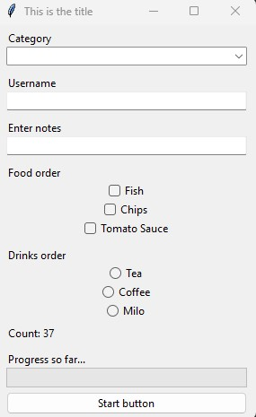

# TKinter Manager
Need a GUI quickly? The TKinter Manager can help, reducing the amount of time you have to spend writing boilerplate code.

## Installation
Clone the repo - no extra libraries needed.

## Usage
To create a new TKinter Manager instance:
```
from tkinter_manager import TKinterManager
manager = TKinterManager(
    title="This is the title"
)
```

To add an element (also known as [widgets in TKinter](https://www.geeksforgeeks.org/what-are-widgets-in-tkinter/))
```
manager.add_element(
	element_name='category',
	element_type='dropdown',
    values=['A', 'B', 'C']
)
```

### Types of TKinter Manager Elements

**Singular Elements**

Button
```
manager.add_element(
	element_name='Start Button',
	element_type='button',
	hook_function=app.execute
)
```

Dropdown
```
manager.add_element(
	element_name='Category',
	element_type='dropdown',
    values=['A', 'B', 'C']
)
```

Label
```
manager.add_element(
	element_name='Message Box',
	element_type='label',
)
```

Progress Bar
```
manager.add_element(
	element_name='Progress Bar',
	element_type='progress_bar',
)
```

Text Input
```
manager.add_element(
	element_name='Username',
	element_type='text_input',
)
```

**Grouped Elements**  

Checkboxes
```
manager.add_element(
	element_name='Food Order',
	element_type='checkboxes',
	values=['Fish', 'Chips', 'Tomato Sauce']
)
```

Radio Buttons
```
manager.add_element(
	element_name='Drinks Order',
	element_type='radio_buttons',
    values=['Tea', 'Coffee', 'Milo']
)
```

### Adding labels
By default, labels are added automatically for each element you add to your TKinter Manager GUI. The name of a label is specified by the name that you choose for your element.  

```
manager.add_element(
	element_name='Username',
	element_type='text_input',
)
```


To change a label's default text, set the `label_text` argument:

```
manager.add_element(
	element_name='Username',
	element_type='text_input',
    label_text='Enter a username:'
)
```


To not show a label for an element, set the `show_label` argument:

```
manager.add_element(
	element_name='Username',
	element_type='text_input',
    show_label=False
)
```


### Accessing an element
To access an element, use the `manager.get_element()` method:
```
name = "Notes"
manager.add_element(
	element_name=name,
	element_type='text_input'
)
name_element = manager.get_element(name)
```

Automatically-added labels can be accessed with the parent element name + "\_label".
```
name = "Progress Bar"
label_text = "Progress so far..."
manager.add_element(
	element_name=name,
	element_type='progress_bar',
    label_text=label_text
)
progress_bar_label = manager.get_element(f"{name}_label")
```


### Setting the layout
To centre all added elements, use the `manager.centre_elements()` method. This also makes the elements reactive when resizing the window.

```
manager = TKinterManager("This is the title")
manager.add_element(
	element_name='Category',
	element_type='dropdown',
    values=['A', 'B', 'C']
)
manager.add_element(
	element_name='Username',
	element_type='text_input',
)
manager.add_element(
	element_name='Notes',
	element_type='text_input',
	label_text='Enter notes'
)
manager.add_element(
	element_name='Start Button',
	element_type='button',
	hook_function=app.execute
)
manager.centre_elements()
manager.run()
```


To explicitly specify an element's place in a grid, use the `manager.set_layout(layout_schema)` method. The input must be a 2D array.

```
manager = TKinterManager("This is the title")
manager.add_element(
	element_name='Category',
	element_type='dropdown',
    values=['A', 'B', 'C']
)
manager.add_element(
	element_name='Username',
	element_type='text_input',
)
manager.add_element(
	element_name='Notes',
	element_type='text_input',
	label_text='Enter notes'
)
manager.add_element(
	element_name='Start Button',
	element_type='button',
	hook_function=app.execute
)
layout = [
    ["Category_label", "Category",],
    ["Username_label", "Username"],
    ["Notes_label", "Notes"],
    [None, "Start Button"],
]
manager.set_layout(layout)
manager.run()
```


## Full example
See [the full example code](/examples/full.py) to test it out.  

